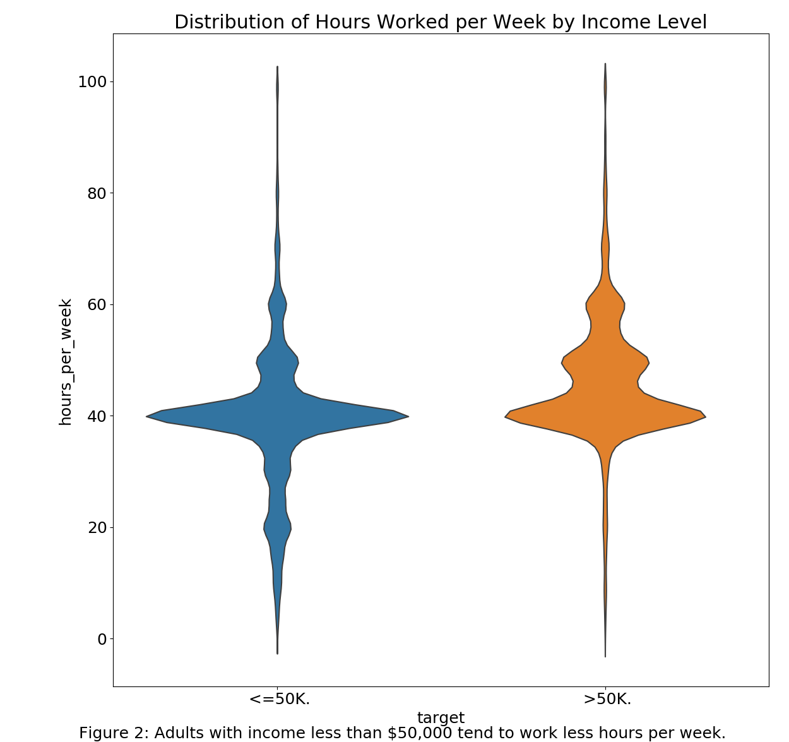
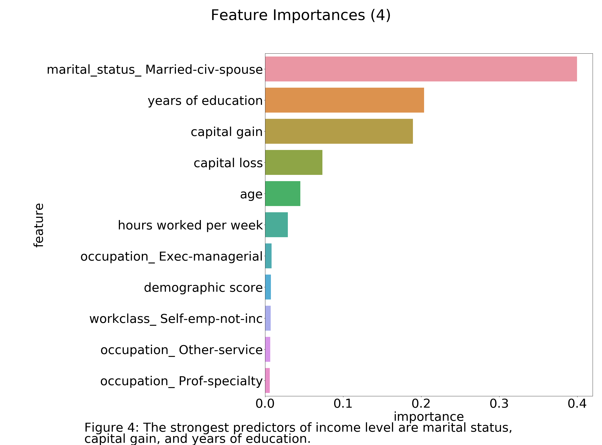

Income level predictors among US Adults
================

Problem Statement:
------------------

The income levels across the US are influenced by various factors based on geography, societal and political. The US census has attributed the drivers for income level across the country to features like race, nativity, education , profession etc. The presence of prevalent inequity in income distribution is a valid motivation to find the factors that influence them.

We are interested in the strongest predictors of income level of US adults.

Dataset Overview
----------------

The dataset includes various demographic and employment details of a sample of US adults. The data set has a total of 14 attributes consisting of eight categorical and six continuous attributes. In the dataset, there are records missing occupation field, native country, and if an adult was working in the private or public sector. These records, which made up about 7% of the total records, were ignored during analysis.

### Features Description

-   workclass: Private, Self-emp-not-inc, Self-emp-inc, Federal-gov, Local-gov, State-gov, Withoutpay, Never-worked. 69.4% values are Private
-   education: Bachelors, Some-college, 11th, HS-grad, Prof-school, Assoc-acdm, Assoc-voc, 9th, 7th8th, 12th, Masters, 1st-4th, 10th, Doctorate, 5th-6th, Preschool
-   education-num: continuous
-   fnlwgt: continuous
-   marital-status: Married-civ-spouse, Divorced, Never-married, Separated, Widowed, Marriedspouse-absent, Married-AF-spouse
-   occupation: Tech-support, Craft-repair, Other-service, Sales, Exec-managerial, Prof-specialty, Handlers-cleaners, Machine-op-inspct, Adm-clerical, Farming-fishing, Transport-moving, Privhouse-serv, Protective-serv, Armed-Forces
-   relationship: Wife, Own-child, Husband, Not-in-family, Other-relative, Unmarried
-   race: White, Asian-Pac-Islander, Amer-Indian-Eskimo, Other, Black
-   capital-gain: continuous
-   capital-loss: continuous hours-per-week: continuous
-   sex: Female, Male
-   native-country: United-States, Cambodia, England, Puerto-Rico, Canada, Germany, OutlyingUS(Guam-USVI-etc), India, Japan, Greece, South, China, Cuba, Iran, Honduras, Philippines, Italy, Poland, Jamaica, Vietnam, Mexico, Portugal, Ireland, France, Dominican-Republic, Laos, Ecuador, Taiwan, Haiti, Colombia, Hungary, Guatemala, Nicaragua, Scotland, Thailand, Yugoslavia, ElSalvador, Trinidad and Tobago, Peru, Hong, Holland-Netherlands

### Label

-   Income: &lt;=50K, &gt;=50K (binomial label)

<table>
<colgroup>
<col width="3%" />
<col width="7%" />
<col width="7%" />
<col width="3%" />
<col width="4%" />
<col width="14%" />
<col width="19%" />
<col width="12%" />
<col width="8%" />
<col width="6%" />
<col width="2%" />
<col width="2%" />
<col width="3%" />
<col width="3%" />
<col width="3%" />
</colgroup>
<thead>
<tr class="header">
<th>Age</th>
<th>Workclass</th>
<th>Education</th>
<th>Years of Education</th>
<th>Fnlwgt</th>
<th>Marital Status</th>
<th>Occupation</th>
<th>Relationship</th>
<th>Race</th>
<th>Capital Gain</th>
<th>Capital Loss</th>
<th>Hours per Week</th>
<th>Sex</th>
<th>Native Country</th>
<th>income Level</th>
</tr>
</thead>
<tbody>
<tr class="odd">
<td>25</td>
<td>Private</td>
<td>226802</td>
<td>11th</td>
<td>7</td>
<td>Never-married</td>
<td>Machine-op-inspct</td>
<td>Own-child</td>
<td>Black</td>
<td>Male</td>
<td>0</td>
<td>0</td>
<td>40</td>
<td>United-States</td>
<td>&lt;=50K.</td>
</tr>
<tr class="even">
<td>38</td>
<td>Private</td>
<td>89814</td>
<td>HS-grad</td>
<td>9</td>
<td>Married-civ-spouse</td>
<td>Farming-fishing</td>
<td>Husband</td>
<td>White</td>
<td>Male</td>
<td>0</td>
<td>0</td>
<td>50</td>
<td>United-States</td>
<td>&lt;=50K.</td>
</tr>
<tr class="odd">
<td>28</td>
<td>Local-gov</td>
<td>336951</td>
<td>Assoc-acdm</td>
<td>12</td>
<td>Married-civ-spouse</td>
<td>Protective-serv</td>
<td>Husband</td>
<td>White</td>
<td>Male</td>
<td>0</td>
<td>0</td>
<td>40</td>
<td>United-States</td>
<td>&gt;50K.</td>
</tr>
<tr class="even">
<td>44</td>
<td>Private</td>
<td>160323</td>
<td>Some-college</td>
<td>10</td>
<td>Married-civ-spouse</td>
<td>Machine-op-inspct</td>
<td>Husband</td>
<td>Black</td>
<td>Male</td>
<td>7688</td>
<td>0</td>
<td>40</td>
<td>United-States</td>
<td>&gt;50K.</td>
</tr>
</tbody>
</table>

Data Cleansing:
---------------

The data had special characters as values under workclass and marital status and these rows were filtered out. For the categorical features we replaced the string values with dummy variables. These features are: workclass, education, marital status, occupation, relationship status, sex, native country, and race.

Exploratory Data Analysis
-------------------------

The exploratory analysis was done on the cleaned data before encoding the categorical attributes. The results of the exploratory analysis are as follows.

This figure provides an insight into the different education levels and their incomes. The variation of age when income is above USD50,000 is less than the variation of age when income is below USD50,000.

The distribution of income level for people who are from the US shows a higher count because there may be more people who are from the US that are present in the data than people who are from other countries. Since the data comes from the 1994 US Census, this result is unsurprising.

The people who earn more than USD50,000 have a higher hours per week compare to people who earn less than USD 50,000. Also, the variance of hours per week for peole earning less than USD50,000 is more than the other group.

Methodology
-----------

Initial EDA showed relationship between features and income level(label). Also the relationship between the features and the labels were not linear so we can answer our problem statement using a decision tree.

### Determine the best depth:

The clean census data was encoded foe dummy variables on the categorical features. The labels and features were split for input and labels. We used scikit-learn package to iterate the decision tree model over different values for the depth. For each depth of the decision tree we ran a cross validation of 10 fold on the training data. The cross validation score was recorded for each trial of the depth in decision tree. We found the maximum depth for highest cross validation score was 7.

### Determine the best feature:

Based on the depth for the maximum cross validation score we fitted the model on the training data. We applied the scikit-learn package for best feature score based on highest gini importance score.

Findings
--------

Based on the gini importance score we found that top three features are marital status, educantion\_num and capital gain. The maximum depth of decision tree was 9. We also found the training accuravy of 0.87 and test accuracy of 0.86. Out test accuracy and train accuracy approximates closer which is an indicator of a optimal prediction model.

Critique
--------

The features' importance was derived from our decision tree model. But compared to a linear regression model, where the weights are slopes, the importances from our tree are less intuitive. The exploratory data can be used to find potential relationship between features ad can be combined to improve efficiency.

Our data is from 1994, so the results may not represent the current predictors. The sample that we used may not be representative of the total US population.

Future Directions
-----------------

We can use the most recent census data on income levels. Also, we could try different models to find the predictors of income levels. The model fitting can be done ok KNN, KNN Regressor for optimal values of hyper parameters to get a validation of best features.

References
----------

Data source: <https://archive.ics.uci.edu/ml/datasets/Census+Income>

"The United States is undergoing a second Gilded Age, and it shows the same struggle has defined America for 150 years": <https://www.businessinsider.com/us-inequality-sparked-second-gilded-age-2018-9>
